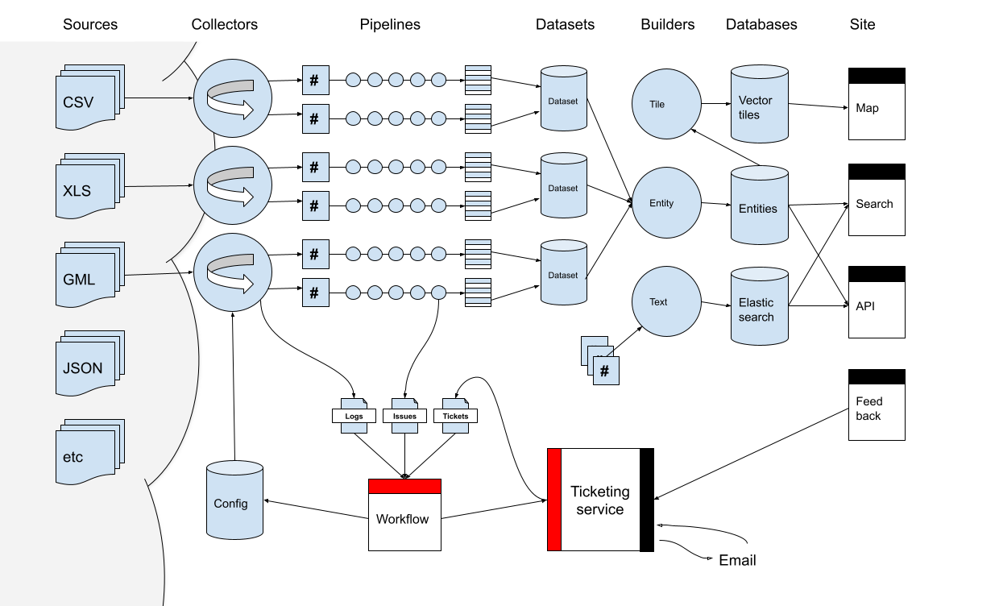

## Digital Land

##  Overview

The core value proposition of Digital Land is to present Geographical Information System (GIS) data, in the form of static artifacts and API endpoints, to relevant consumers. The data served will primarily be focused around that which would impact UK planning applications in the short or long term.

This data is ingested from various third parties, including central government, local government and third party sources (e.g. ordinance survey). This data is ingested via HTTP/S polling and transformed into a data set artifacts which are then served through the [digital land website](https://www.digital-land.info/dataset/) and [digital land API](https://www.digital-land.info/docs). The frequency of this polling is currently once per day, and is triggered via [Github Actions](https://github.com/features/actions) run against the Github repository for a [specific collection](https://github.com/orgs/digital-land/repositories?q=collection&type=&language=&sort=)

## Architecture




### Pipeline run process

For a collection that executes via Github Actions, the execution flow is defined within [`./.github/workflows/run.yml](https://github.com/digital-land/brownfield-land-collection/blob/main/.github/workflows/run.yml)

The typical execution flow for a pipeline might look like:
1. Update makerules
2. Commit updated makerules
3. Install dependencies
4. Fetch dataset files from S3
5. Run the collector
6. Commit collection
7. Update the collection dataset
8. Commit updated collection
9. Push collection files to S3
10. Run the pipeline to make the dataset
11. Commit harmonised files
12. Push dataset files to S3

#### Update makerules/Commit updated makerules

* Makefile rules are version controlled within https://github.com/digital-land/makerules/
* For the collection repos these definitions are refreshed as the first stage of the pipeline run, and commited to the collection repository

#### Install dependencies

* Install the collector and assoicated python dependencies defined within the collector repository (typically within `requirements.txt` or `setup.py`)
* If `specification` files are defined for this collector, they are also refreshed from [the specification repo](https://github.com/digital-land/specification/) on Github.

#### Fetch dataset files from S3

* Existing dataset files are fetched from S3 via `aws s3 sync`
* These represent the output of previous pipeline runs

#### Run the collector

* Entrypoint for collector is typically in `makerules/collection.mk`
  * This will call through to the `collect` entrypoint contained within the [`digital-land` cli](https://github.com/digital-land/digital-land-python)
* Passed into this command will be the path to the CSV file containing endpoints to be polled for this collection.
* For each poll, if the poll doesn't terminate in an error condition, the raw payloads fetched will be saved in `collection/log/<iso-date>/<hash>.<extension>`
  * where `<iso-date>` is the [ISO 8601 Calendar date with day of month](https://en.wikipedia.org/wiki/ISO_8601#Calendar_dates) and `<hash>` is the `SHA256` hash of the content returned from the poll.

#### Commit collection

* The `collection` folder, containing the raw payloads fetched in the previous step are commited to the collection repository, and pushed to the upstream remote in Github

#### Update the collection dataset

* This step updates the `collection/log.csv` and `collection/resource.csv` files
  * `collection/resource.csv` contains a record of the latest attempt to update a collection, with the hash and size of the result, along with organization type, endpoints polled and start and end date
  * `collection/log.csv` contains records corresponding to every attempt made to poll and endpoint, the content type, status code, start date, end date and time taken
* A new make entrypoint is added to the local `collection/pipeline.mk` which serves this dataset

#### Commit updated collection

* The `collection` folder, containing the files modified in the previous step are commited to the collection repository, and pushed to the upstream remote in Github

#### Push collection files to S3

* The `collection` folder, containing the files modified in the previous steps are pushed up to the collection S3 bucket

#### Run the pipeline to make the dataset

* The `make dataset` entrypoint is aliased to the `build-dataset` `make` macro.

* `load-entries` will load the artifacts and insert them into a local sqllite3 database

* `build-dataset` is an interface to serialize data from a local sqllite3 database
  * It queries the database via the `slugs` table to discover which data sources it will attempt to update
  * It then rebuild's the `Entity`s from `Slug`'s in memory from a snapshot, once they've been table having validated it against a schema
  * And writes those to disk as a CSV

#### Commit harmonised files

#### Push dataset files to S3

#### Datasettee stuff goes here???


### Anatomy of a collection repository

### Inputs

Within a repository, the sources to be polled are contained in collection/sources.csv

### Outputs

collection/log.csv is appended


### Execution Environment

Currently most of the pipeline is triggered via Github Actions which are triggered on a daily basis.

Some of these more long-running jobs have been moved over to AWS Batch

<!-- Output of each pipeline is a CSV -->

## Infrastructure

Heroku (dashboard, design system)
AWS (everything else)

## Monitoring

https://digital-land-dashboard.herokuapp.com/

## Services

### Frontend

### Datasettee

## Data model

### Domain Terminology
* Entity
* Slug
* Entry
* Fact
* Provenance

### Base data model:
* "entity" (name could change) (refered to as record on the frontend)
* start date
* end date
* geojson (transformed to point or polygon)
* well-known-text
* typology
* JSON (dumping ground, keys may be promoted to proper fields at some point)

Example: [Brownfield land](https://github.com/digital-land/brownfield-land-collection/blob/547a6d4b79a9dfa3bcb7dcbe59502c3c0c1cd09e/fixed/f19782aef6adaa956ae2e4c28f69bd042ece9d7f5d6a5490e1e71fc636e4e249.txt#L1)

```
PermissionDate
PlanningHistory
ProposedForPIP
MinNetDwellings
DevelopmentDescription
NonHousingDevelopment
Part2
NetDwellingsRangeFrom
NetDwellingsRangeTo
HazardousSubstances
SiteInformation
Notes
FirstAddedDate
LastUpdatedDate
OrganisationURI
OrganisationLabel
SiteReference
PreviouslyPartOf
SiteNameAddress
SiteplanURL
CoordinateReferenceSystem
GeoX
GeoY
Hectares
OwnershipStatus
Deliverable
PlanningStatus
PermissionType
```

## List of Datasets

## External Links

### Live Site
* [Digital Land homepage](https://www.digital-land.info/)
* [Digital Land API Documentation](https://www.digital-land.info/docs)

### Useful Repositories
* [Digital Land CLI Repository](https://github.com/digital-land/digital-land-python)
* [Digital Land Makerules Repository](https://github.com/digital-land/makerules/)
* [Digital Land Specification Repository](https://github.com/digital-land/specification/)

### Other Documentation
* [Living Document](https://docs.google.com/presentation/d/1kwbPaEcKrRej2ckVFibwu1YYDfh5SdKIXNZradcbEaM/edit#slide=id.ge28ee0d90f_0_34)

