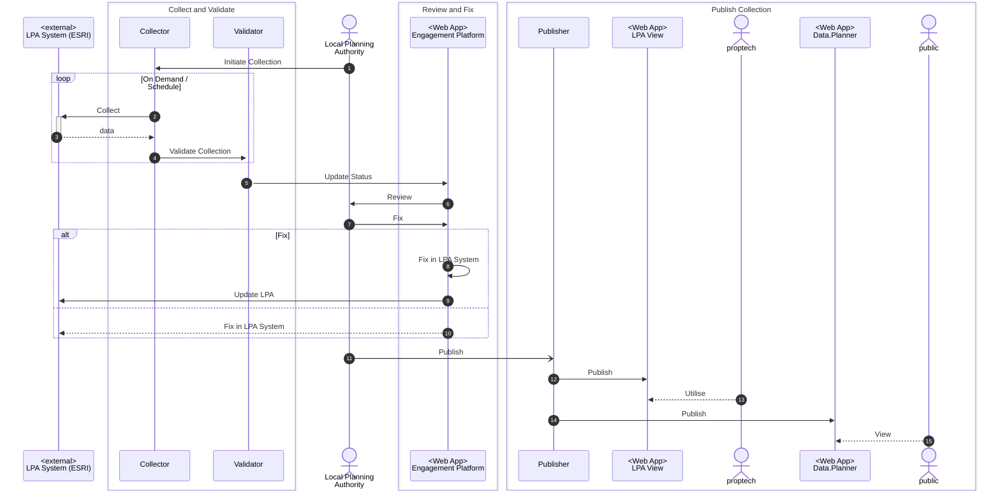

# Sequence of Events in getting anbd publishing a collection

This diagram represents the processing of a collection, initiated either by a LPA Officer or by a scheduled process.

It is intended to help clarify what happen, and in what order and what triggers what.

You can take the contents of this diagram to https://mermaid.live/ and paste it in to see it as you edit it.
